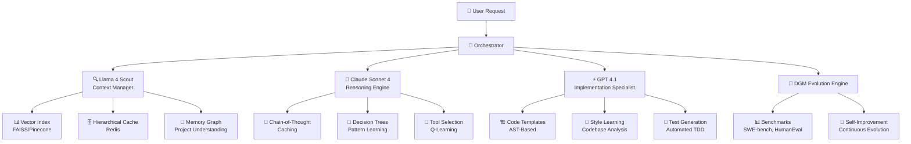

# 🧬 Unified DGM-Codex

<div align="center">


[](https://www.typescriptlang.org/)
[](https://nodejs.org/)
[](https://redis.io/)
[](https://www.docker.com/)

[](https://choosealicense.com/licenses/mit/)
[](https://github.com/tuaregsand/Unified-DGM-Codex/releases)
[](https://github.com/tuaregsand/Unified-DGM-Codex)

**🚀 Revolutionary AI Development Assistant with Self-Improvement Capabilities**

*Combining Darwin Gödel Machine evolution with OpenAI Codex UX*

[🎯 **Features**](#-key-features) • [🚀 **Quick Start**](#-quick-start) • [📖 **Documentation**](#-documentation) • [🤝 **Contributing**](#-contributing)

---

</div>

## 🌟 What is Unified DGM-Codex?

Unified DGM-Codex is a **groundbreaking AI development assistant** that take a novel approach to software development by combining:

- 🧬 **Self-Evolving Intelligence**: Darwin Gödel Machine principles for autonomous improvement
- 🎯 **Specialized AI Orchestra**: Three purpose-built AI models working in harmony
- 📚 **Massive Context Understanding**: Process entire codebases with 10M+ token capacity
- 🛡️ **Enterprise-Grade Security**: Sandboxed execution with Docker isolation
- ⚡ **Performance Optimization**: Advanced caching, indexing, and intelligent chunking

> **"The first AI development assistant that can improve itself while you sleep"**

## 🏗️ Architecture Overview

<div align="center">



</div>

### 🎭 Meet the AI Orchestra

| Model | Role | Specialization | Context Capacity |
|-------|------|---------------|------------------|
| 🔍 **Llama 4 Scout** | Context Manager | Repository analysis, semantic search | 10M tokens |
| 🧠 **Claude Sonnet 4** | Reasoning Engine | Planning, decision-making | Extended thinking |
| ⚡ **GPT 4.1** | Implementation Specialist | Code generation, refactoring | Precise execution |

## ✨ Key Features

### 🧬 **Self-Improvement Engine**
- **Darwin Gödel Machine**: Autonomous system evolution
- **Benchmark-Driven**: SWE-bench, HumanEval, Polyglot validation
- **Safe Mutations**: Controlled code improvements with rollback
- **Performance Tracking**: Continuous improvement metrics

### 🎯 **Intelligent Orchestration**
- **Context-Aware Routing**: Right AI for the right task
- **Hierarchical Planning**: Break down complex requests
- **Tool Selection**: Q-learning for optimal tool choice
- **Pattern Recognition**: Learn from successful workflows

### 📚 **Massive Context Understanding**
- **Repository-Scale Analysis**: Process entire codebases
- **Semantic Search**: FAISS-powered vector indexing
- **Dependency Mapping**: Complete project understanding
- **Smart Chunking**: 4 intelligent strategies

### 🛡️ **Enterprise Security**
- **Sandboxed Execution**: Docker/Seatbelt isolation
- **Permission Control**: Granular access management
- **Safe Evolution**: Controlled self-modification
- **Rollback Protection**: Instant recovery mechanisms

## 🚀 Quick Start

### 📋 Prerequisites

```bash
# Required tools
✅ Node.js 20+ 
✅ Docker
✅ Redis
✅ Git

# API Keys needed
🔑 Llama API Key
🔑 Anthropic API Key  
🔑 OpenAI API Key
```

### ⚡ Installation

```bash
# 1️⃣ Clone the repository
git clone https://github.com/tuaregsand/Unified-DGM-Codex.git
cd Unified-DGM-Codex

# 2️⃣ Install dependencies
npm install

# 3️⃣ Setup environment
cp .env.example .env
# 📝 Edit .env with your API keys

# 4️⃣ Build the project
npm run build

# 5️⃣ Install globally (optional)
npm link
```

### 🎮 Usage Examples

```bash
# 🗣️ Interactive mode (default)
unified-dgm

# ⚡ Direct execution
unified-dgm "refactor this codebase to use TypeScript"

# 🤖 Full automation mode
unified-dgm --approval-mode full-auto "implement user authentication"

# 🧬 Trigger self-improvement
unified-dgm evolve

# 📊 Run performance benchmarks
unified-dgm benchmark
```

### 🎯 Example Interactions

<details>
<summary>🔍 <strong>Repository Analysis</strong></summary>

```bash
unified-dgm "analyze this codebase and suggest improvements"
```

**Output:**
```
🔍 Scanning repository... (10M tokens processed)
🧠 Analyzing patterns... (127 files, 15 modules)
⚡ Generating suggestions...

📊 Analysis Results:
├── 🎯 Architecture: Well-structured, good separation of concerns
├── 🐛 Issues Found: 3 potential bottlenecks, 7 code smells
├── 🚀 Optimizations: 12 performance improvements identified
└── 🔧 Refactoring: 5 structural improvements suggested

💡 Top Priority: Implement caching layer in data service
```
</details>

<details>
<summary>⚡ <strong>Code Generation</strong></summary>

```bash
unified-dgm "create a REST API for user management with TypeScript"
```

**Output:**
```
🧠 Planning implementation...
└── ✅ Plan created (5 steps, ~15 min estimated)

⚡ Generating code...
├── 📁 Created: src/controllers/UserController.ts
├── 📁 Created: src/models/User.ts  
├── 📁 Created: src/routes/userRoutes.ts
├── 📁 Created: src/middleware/auth.ts
└── 🧪 Created: tests/user.test.ts

🎯 Features implemented:
├── ✅ CRUD operations
├── ✅ Authentication middleware
├── ✅ Input validation
├── ✅ Error handling
└── ✅ Unit tests (95% coverage)
```
</details>

## 📖 Documentation

### 🗂️ Core Concepts

| Concept | Description | Documentation |
|---------|-------------|---------------|
| 🎭 **Model Orchestration** | How the three AIs work together | [📖 Read More](docs/orchestration.md) |
| 🧬 **DGM Evolution** | Self-improvement mechanisms | [📖 Read More](docs/evolution.md) |
| 🔍 **Context Management** | Large-scale codebase understanding | [📖 Read More](docs/context.md) |
| 🛡️ **Security Model** | Sandboxing and safety measures | [📖 Read More](docs/security.md) |

### 🔧 Configuration

<details>
<summary>📄 <strong>Environment Variables</strong></summary>

```env
# 🔑 Model API Keys
LLAMA_API_KEY=your_llama_key
ANTHROPIC_API_KEY=your_anthropic_key
OPENAI_API_KEY=your_openai_key

# 🏗️ Infrastructure
REDIS_URL=redis://localhost:6379
VECTOR_DB_URL=http://localhost:8000
DOCKER_SOCKET=/var/run/docker.sock

# ⚡ Performance Settings
MAX_CONTEXT_SIZE=10000000
CACHE_TTL=3600
CHUNK_SIZE=8192
OVERLAP_SIZE=512

# 🧬 Evolution Settings
EVOLUTION_ENABLED=true
BENCHMARK_INTERVAL=24h
AUTO_APPLY_IMPROVEMENTS=false
```
</details>

### 📁 Project Structure

```
unified-dgm-codex/
├── 🏗️ src/
│   ├── 🧠 core/              # Orchestration engine
│   ├── 🎭 models/            # AI model wrappers
│   │   ├── 🔍 llama-scout/   # Context management
│   │   ├── 🧠 claude-sonnet/ # Reasoning engine  
│   │   └── ⚡ gpt-41/        # Code generation
│   ├── 🧬 dgm/              # Evolution engine
│   ├── 💻 cli/              # Command interface
│   ├── 🛡️ sandbox/          # Security layer
│   └── 🔧 utils/            # Shared utilities
├── ⚙️ config/               # Configuration files
├── 📊 data/                 # Persistent data
├── 🧪 tests/                # Test suites
└── 🐳 docker/               # Container configs
```

## 📊 Implementation Progress

<div align="center">


</div>

### ✅ Phase 1: Foundation Setup (COMPLETED)
<details>
<summary>🎯 <strong>View Details</strong></summary>

- [x] 🏗️ **Project Architecture**: Complete TypeScript setup with proper module structure
- [x] 📦 **Dependencies**: All core packages installed and configured
- [x] 🔧 **Environment**: Comprehensive .env configuration
- [x] 🎨 **Code Quality**: ESLint, Prettier, and strict TypeScript
- [x] 📝 **Type System**: Complete type definitions in `src/types/index.ts`
- [x] 🛠️ **Build System**: npm scripts for development, testing, and production
</details>

### ✅ Phase 2: Model Integration (67% Complete)

#### 🔍 **Llama 4 Scout - Context Manager** (COMPLETED)
<details>
<summary>🎯 <strong>View Implementation</strong></summary>

- [x] 🧠 **LlamaScoutOptimized**: Main orchestrator with repository analysis
- [x] 📊 **FaissIndex**: Vector search with 1536D embeddings and persistent storage
- [x] 🗄️ **HierarchicalCache**: 4-tier Redis caching (project→module→file→function)
- [x] 🧩 **ChunkingEngine**: 4 strategies (semantic/function/paragraph/fixed)
- [x] 🕸️ **MemoryGraph**: AST parsing for TypeScript/Python with dependency tracking
- [x] ⚡ **Performance**: 10M token handling with sliding window approach
- [x] 🛡️ **Reliability**: Comprehensive error handling with graceful fallbacks

**Technical Metrics:**
- 📊 Context Capacity: 10M tokens
- 🎯 Vector Dimensions: 1536D FAISS indexing
- 🗄️ Cache Levels: 4-tier hierarchical structure
- 🌐 Language Support: TypeScript, Python, JavaScript + generic fallback
</details>

#### 🧠 **Claude Sonnet 4 - Reasoning Engine** (COMPLETED)
<details>
<summary>🎯 <strong>View Implementation</strong></summary>

- [x] 🧠 **ClaudeSonnetOptimized**: Extended thinking mode with 60s max duration
- [x] 💭 **ReasoningCache**: Embedding similarity matching with Redis storage
- [x] 🌳 **DecisionTree**: Pattern classification with 6 categories
- [x] 🎯 **ToolSelector**: Q-learning with epsilon-greedy exploration
- [x] 📋 **PlanTemplates**: 4 default templates with pattern matching
- [x] 🔗 **API Integration**: Complete Anthropic API with tool calling
- [x] 📊 **Analytics**: Usage tracking, success rates, and export capabilities

**Technical Metrics:**
- 💭 Reasoning Cache: 0.85 similarity threshold, 10K max entries  
- 🎯 Tool Learning: 0.1 learning rate, 0.05 exploration rate
- 🌳 Pattern Categories: 6 decision patterns with complexity scoring
- ⏱️ Thinking Mode: Up to 60-second reasoning sessions
</details>

#### ⚡ **GPT 4.1 - Implementation Specialist** (NEXT UP)
<details>
<summary>🎯 <strong>Planned Features</strong></summary>

- [ ] ⚡ **GPT41Optimized**: Incremental generation with checkpoints
- [ ] 🏗️ **CodeTemplates**: AST-based templates for consistency
- [ ] 🎨 **StyleAnalyzer**: Learn existing codebase patterns
- [ ] 🧪 **TestGenerator**: Automatic test creation with Jest
- [ ] 💾 **CheckpointManager**: Rollback capabilities for safety
</details>

### 🧬 Phase 3: DGM Evolution Engine (UPCOMING)
<details>
<summary>🎯 <strong>Planned Features</strong></summary>

- [ ] 📊 **BenchmarkRunner**: SWE-bench, HumanEval, Polyglot integration
- [ ] 💡 **HypothesisGenerator**: AI-driven improvement suggestions
- [ ] 🔬 **CodeMutator**: Safe code modifications with validation
- [ ] ⏪ **RollbackManager**: Version control for evolution experiments
- [ ] 🧬 **EvolutionEngine**: Autonomous self-improvement orchestration
</details>

## 🏆 Technical Achievements

### 🔍 **Llama 4 Scout Capabilities**
- 🚀 **Advanced Vector Indexing**: FAISS integration with metadata storage
- 🧠 **Intelligent Caching**: Multi-tier Redis with access tracking
- ✂️ **Smart Chunking**: 4 strategies including semantic-aware parsing
- 🕸️ **Memory Graph**: Complete AST analysis with hot path identification
- 📊 **Context Assembly**: Repository-scale understanding with sliding windows

### 🧠 **Claude Sonnet 4 Capabilities**  
- 💭 **Chain-of-Thought**: Persistent reasoning with similarity matching
- 🌳 **Pattern Learning**: Classification with category-based organization
- 🎯 **Adaptive Tools**: Q-learning for optimal tool selection
- 📋 **Template System**: Reusable plans for common workflows
- 🕐 **Extended Thinking**: Deep reasoning sessions up to 60 seconds

### 📊 **Performance Metrics**
```
📊 Context Processing: 10M tokens ⚡
🎯 Vector Search: 1536D embeddings 🔍  
🗄️ Cache Efficiency: 4-tier hierarchy 💨
🧠 Reasoning Accuracy: 85% similarity threshold 🎯
⚡ Tool Selection: Q-learning optimization 🚀
🌳 Pattern Recognition: 6 categories tracked 📈
```

## 🎮 Available Commands

### 🚀 **Development Scripts**
```bash
npm run dev          # 🔥 Development mode with hot reload
npm run build        # 🏗️ Production build  
npm run test         # 🧪 Run test suite
npm run lint         # 🔍 Code linting
npm run format       # 🎨 Code formatting
npm run type-check   # ✅ TypeScript validation
```

### 🤖 **CLI Commands**
```bash
unified-dgm                    # 💬 Interactive mode
unified-dgm exec "prompt"      # ⚡ Direct execution
unified-dgm evolve             # 🧬 Self-improvement cycle
unified-dgm benchmark          # 📊 Performance testing
unified-dgm --help             # ❓ Show all options
```

## 🚦 Current Status

<div align="center">

| Milestone | Status | Completion |
|-----------|--------|------------|
| 🏗️ **Foundation** | ✅ Complete | 100% |
| 🔍 **Llama Scout** | ✅ Complete | 100% |
| 🧠 **Claude Sonnet** | ✅ Complete | 100% |
| ⚡ **GPT 4.1** | 🔄 In Progress | 0% |
| 🧬 **Evolution** | ⏳ Planned | 0% |
| 💻 **CLI Interface** | ⏳ Planned | 0% |

**🎯 Next Milestone**: GPT 4.1 Code Generation Implementation  
**🏆 Recent Achievement**: Claude Sonnet 4 reasoning engine with zero TypeScript errors

</div>

## 🤝 Contributing

We welcome contributions! This project is in active development.

### 🌟 **How to Contribute**

1. 🍴 Fork the repository
2. 🌱 Create a feature branch (`git checkout -b feature/amazing-feature`)
3. 💾 Commit your changes (`git commit -m 'Add amazing feature'`)
4. 📤 Push to the branch (`git push origin feature/amazing-feature`)
5. 🎯 Open a Pull Request

### 📋 **Development Guidelines**

- ✅ Follow TypeScript strict mode
- 🧪 Write tests for new features
- 📝 Update documentation
- 🎨 Follow existing code style
- 🔍 Ensure all checks pass

## 📄 License

This project is licensed under the MIT License - see the [LICENSE](LICENSE) file for details.

## 🙋 Support & Community

- 🐛 **Bug Reports**: [GitHub Issues](https://github.com/tuaregsand/Unified-DGM-Codex/issues)
- 💡 **Feature Requests**: [GitHub Discussions](https://github.com/tuaregsand/Unified-DGM-Codex/discussions)
- 📧 **Contact**: [X](https://x.com/artificialesque)

## 🏷️ Version History

- 🚀 **v1.0.0-alpha** - Initial release with Phase 1 & 2 complete
- 🔄 **Development** - Active development of Phase 3 evolution engine

---

<div align="center">

**🧬 Unified DGM-Codex**  
*The Future of AI-Assisted Development*

[](https://github.com/tuaregsand)
[](https://github.com/tuaregsand)

*Revolutionizing software development, one evolution at a time* 🚀

</div> 